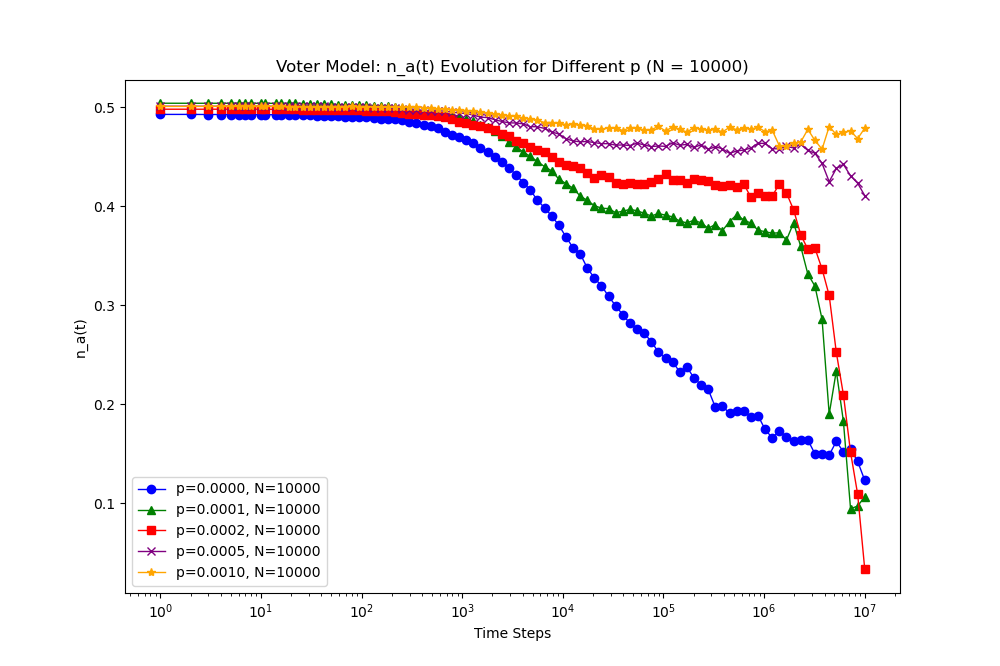
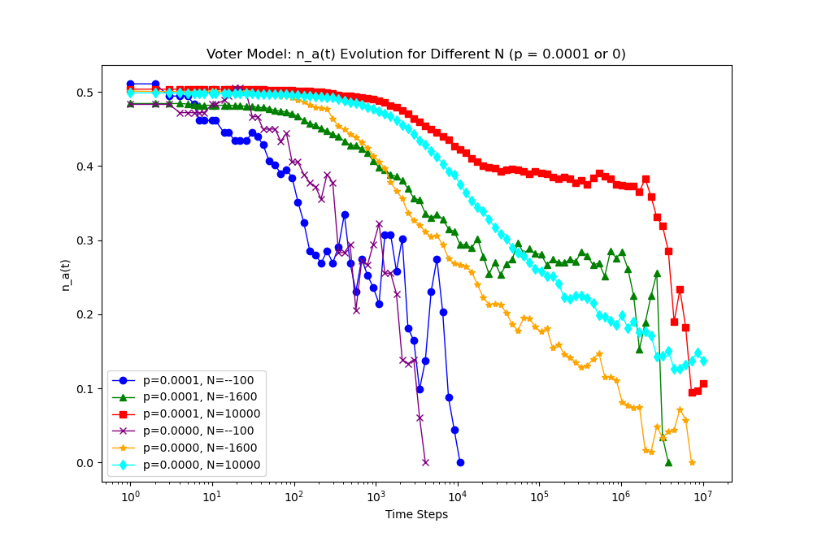
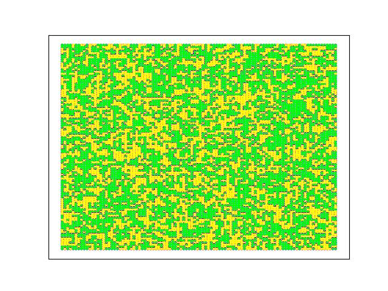
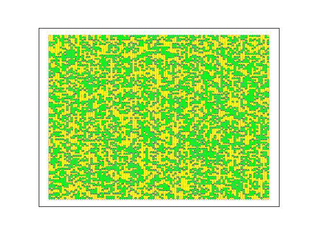

# Voter-Model-Long-Range-Interactions

This repository contains simulation codes for studying the Voter model on a 2D lattice with long-range interactions. It includes tools to visualize opinion dynamics over time and observe the effects of varying the network size (N) and the proportion of long-range edges (p) on the duration of metastable states (plateaus).

## Question description


1. Read this week’s information
 
2. Based on existing research, try to randomly add (or randomly reconnect) long-range edges with a proportion of $p$ on the lattice network of $d=2$, and observe whether $n_a(t)$ of the Voter model changes over time. There will be a relatively flat interval (called plateau), when the system is in a metastable state. Please observe the changing pattern of the plateau length (that is, the duration of the metastable state) by changing $N$ and $p$. In addition, considering that the grid of $d=2$ is very easy to visualize (each node can be assigned plane coordinates), please conduct a random simulation ($N$ is recommended to be larger, $p$ can be changed), and observe the different $p$ When, what shape is the distribution of viewpoints in the plateau period (nodes of different viewpoints are marked with different colors, and edges do not need to be drawn)
 
3. (Additional) Save the visual images of each step of a simulation and synthesize them into videos, so that you can observe the continuous evolution process of viewpoints under the voter model.

Reference API:
 
1. https://networkx.org/documentation/latest/reference/generated/networkx.generators.lattice.grid_2d_graph.html#networkx.generators.lattice.grid_2d_graph
 
2. https://networkx.org/documentation/latest/reference/generated/networkx.drawing.nx_pylab.draw_networkx_nodes.html#networkx.drawing.nx_pylab.draw_networkx_nodes

## Steps for Simulation and Visualization

1. Set Up the Simulation Environment:
Import necessary libraries: networkx for graph manipulation, matplotlib and networkx for visualization, and numpy for numerical operations.

2. Generate the 2D Lattice:
Use networkx.generators.lattice.grid_2d_graph to create a $d=2$ lattice of size $\sqrt{N} \times \sqrt{N}$ where $N$ is the number of nodes.

3. Add Long-Range Connections:
Iterate over all nodes and add a long-range edge with probability $p$. Ensure that the added edge does not already exist.

4. Initialize Voter States:
Assign each node a random initial state (e.g., 0 or 1 representing different opinions).

5. Simulation of the Voter Model:
Perform the Voter Model dynamics: randomly select a node, then randomly select a neighbor (including long-range connections) and adopt its state.
Record the number of nodes in each state over time ($n_a(t)$).

6. Analysis of the Plateau:
Plot $n_a(t)$ over time to visually inspect for the presence of a plateau. Calculate the length of any observed plateau by determining the interval over which $n_a(t)$ remains relatively unchanged.

7. Visualization of States on the Lattice:
Use networkx.drawing.nx_pylab.draw_networkx_nodes to visualize the state of the lattice at different points in time, particularly during the plateau phase, with different colors representing different states.

8. Adjust Parameters and Repeat:
Vary $N$ and $p$ to observe changes in the plateau's characteristics.

9. Video Creation:
Store each frame of the simulation (each step or at intervals) and use a video creation library to stitch the frames into a video showing the evolution of states.

## Realization Code

```python
import os
import random
import numpy as np
import networkx as nx
import matplotlib.pyplot as plt
import imageio

random.seed(3407)  # 设置固定的随机种子以保证实验可重现性

def create_network(width, height, probability):
    """Create a 2D grid network with additional long-range edges."""
    grid = nx.grid_2d_graph(width, height, periodic=False)
    nodes = list(grid.nodes())
    for node in nodes:
        for target in nodes:
            if target != node and (node, target) not in grid.edges() and random.random() < probability:
                grid.add_edge(node, target)
    return grid

def visualize_network(grid, path):
    """Visualize the network and save the image to the specified path."""
    plt.figure()
    position = {(x, y): (y, -x) for x, y in grid.nodes()}
    color_map = ['red' if grid.nodes[node]['status'] == 1 else 'blue' for node in grid.nodes()]
    nx.draw_networkx_nodes(grid, position, node_color=color_map, node_size=5)
    plt.savefig(path)
    plt.close()

def initialize_network(grid, infected_prob):
    """Initialize the status of each node in the network."""
    positive_nodes_num = round(len(grid) * infected_prob)
    positive_nodes = random.sample(grid.nodes(), positive_nodes_num)
    nx.set_node_attributes(grid, -1, 'status')
    for node in positive_nodes:
        grid.nodes[node]['status'] = 1
    return grid

def update_network(grid):
    """Update the status of a random node based on a random neighbor's status."""
    node = random.choice(list(grid.nodes()))
    neighbors = list(grid.neighbors(node))
    if neighbors:
        selected_neighbor = random.choice(neighbors)
        grid.nodes[node]['status'] = grid.nodes[selected_neighbor]['status']
    else:
        print(f"Node {node} has no neighbors.")

def calculate_edge_diversity(grid):
    """Calculate the proportion of edges with differing statuses."""
    diverse_count = sum(1 for edge in grid.edges if grid.nodes[edge[0]]['status'] != grid.nodes[edge[1]]['status'])
    return diverse_count / len(grid.edges)

def generate_video(image_folder, output_path):
    """Generate a video from a sequence of images."""
    images = sorted([img for img in os.listdir(image_folder) if img.endswith('.jpg')],
                    key=lambda x: int(x.split('.')[0]))
    if not images:
        print("No images found.")
        return
    with imageio.get_writer(output_path, fps=30) as writer:
        for image in images:
            img_path = os.path.join(image_folder, image)
            image_data = imageio.imread(img_path)
            writer.append_data(image_data)
    print(f"Video created successfully at {output_path}")

def main():
    width, height, p = 100, 100, 0.0001
    grid = create_network(width, height, p)
    grid = initialize_network(grid, 0.5)
    visualize_network(grid, './initial_network.jpg')

    evolution_data = {}
    for time_step in range(1, 100000):
        update_network(grid)
        if time_step % 100 == 0:
            edge_diversity = calculate_edge_diversity(grid)
            evolution_data[time_step] = edge_diversity
            visualize_network(grid, f'./Images/{time_step}.jpg')
            if edge_diversity == 0:
                break

    plot_data([evolution_data], './evolution_plot.jpg', 'Network Evolution', 'Time', 'Edge Diversity', scale_log=True)
    generate_video('./Images', './network_evolution.mp4')

if __name__ == '__main__':
    main()
```


## 结果与讨论





观察$n_a(t)$的变化发现：

1. 当N保持不变时，随着p值的增大，平坦区域（亚稳态的持续时长）不断增大。已知 $p$ 值代表网络中加入长程连接的概率。当 $p$ 较低时，网络主要由局部连接（近邻节点）组成，这促使观点在局部区域内快速达到一致，但整个网络达到共识的时间较长。随着 $p$ 的增加，网络引入更多的长程连接，这些连接能够将不同的局部区域连接起来，从而允许信息跨越较大的距离传播。增加 $p$ 值意味着网络从一个接近规则网络（每个节点仅与其直接邻居相连）转变为类似随机网络（节点间连接更加随机）。在随机网络中，信息能够通过较少的跳数从一个节点传播到另一个节点，从而增加整个网络意见一致的速度。然而，在达到完全一致之前，网络往往会在不同观点之间经历较长时间的亚稳态，因为长程连接同时也提供了维持多个意见团体共存的途径，从而延长了平坦区域的存在。

2. 当p保持不变时，随着N值的增大，平坦区域（亚稳态的持续时长）不断增大。 $N$ 值表示网络中节点的数量，即总人口。随着 $N$ 的增加，网络的规模变大，节点间的平均路径长度增加。这使得任何一个意见从网络一端传播到另一端所需的时间增加。更大的 $N$ 值意味着在任何特定时间点，网络中可能存在更多意见的多样性，因为信息需要更长时间才能覆盖整个网络。



上图是 p = 0.0002时



上图是 p = 0.0005时

观察plateau时期的观点分布形态，plateau时期，图像显示两种意见分布在空间上形成了错综复杂的簇状结构。黄色和绿色区块在一些地方形成较大的连续区域，在其他地方则相互交织成较小片段。这种分布不是均匀或随机的，而是显示出特定的局部聚类特性。在Voter模型中，每个个体倾向于采纳其邻居的意见。当网络中包含长程连接时（较高的 
𝑝 值），这些长程连接促进了远距离的意见交换，允许不连续的空间区域形成统一的意见。但即便如此，由于局部的相互作用仍然占主导地位，因此在物理上相邻的个体间形成了意见聚集，导致了图案中观察到的聚类效应。
