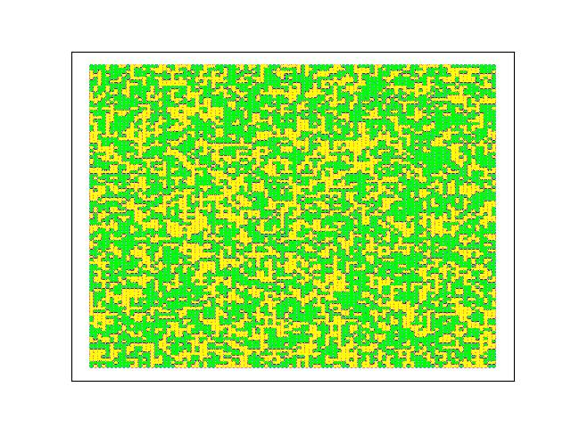

# Voter-Model-Long-Range-Interactions

## 问题描述

1. 阅读本周资料
 
2. 根据既有研究，尝试在$d=2$的格子网络上随机增加（或随机重连）比例为$p$的长程边，观察Voter模型的$n_a(t)$随时间的变化是否会出现一段相对平坦的区间（称为plateau)，此时系统处于亚稳态。请通过变化$N$和$p$来观察plateau长度的变化规律（亦即，亚稳态的持续时长）。另外，考虑到$d=2$的格子非常容易可视化(每个节点可以分配平面坐标)，请对随机的一次仿真（$N$建议大一些，$p$可以变化），观察不同$p$时，处于plateau时期的观点分布成什么形态（不同观点的节点有不同的颜色标记，可以不绘制边）
 
3. （附加）保存某次仿真的每一步可视化图片，进而合成为视频，可以观察voter模型下观点的连续演化过程

## 思路分析

1. **创建网络**: `create_network` 函数创建一个二维格子网络，并随机加入长程边。以实现了在$d=2$的格子网络上随机增加长程边的要求。

2. **初始化网络**: `initialize_network` 函数对网络中的节点进行初始状态赋值。部分节点状态为1，其余为-1，以模拟Voter模型的初始条件。

3. **网络状态更新**: `update_network` 函数模拟了Voter模型的动态更新过程，即随机选择一个节点，并使其状态与随机选取的邻居相同。

4. **计算边的多样性**: `calculate_edge_diversity` 函数计算网络中不同状态节点间边的比例，以观察网络达到平稳状态的时间。

5. **绘图和视频制作**: `plot_data` 和 `generate_video` 函数分别用于绘制$n_a(t)$的变化图和制作节点状态演变的视频。


## 实现代码

```python
import os
import random
import numpy as np
import networkx as nx
import matplotlib.pyplot as plt
import imageio

random.seed(3407)  # 设置固定的随机种子以保证实验可重现性

def create_network(width, height, probability):
    """Create a 2D grid network with additional long-range edges."""
    grid = nx.grid_2d_graph(width, height, periodic=False)
    nodes = list(grid.nodes())
    for node in nodes:
        for target in nodes:
            if target != node and (node, target) not in grid.edges() and random.random() < probability:
                grid.add_edge(node, target)
    return grid

def visualize_network(grid, path):
    """Visualize the network and save the image to the specified path."""
    plt.figure()
    position = {(x, y): (y, -x) for x, y in grid.nodes()}
    color_map = ['red' if grid.nodes[node]['status'] == 1 else 'blue' for node in grid.nodes()]
    nx.draw_networkx_nodes(grid, position, node_color=color_map, node_size=5)
    plt.savefig(path)
    plt.close()

def initialize_network(grid, infected_prob):
    """Initialize the status of each node in the network."""
    positive_nodes_num = round(len(grid) * infected_prob)
    positive_nodes = random.sample(grid.nodes(), positive_nodes_num)
    nx.set_node_attributes(grid, -1, 'status')
    for node in positive_nodes:
        grid.nodes[node]['status'] = 1
    return grid

def update_network(grid):
    """Update the status of a random node based on a random neighbor's status."""
    node = random.choice(list(grid.nodes()))
    neighbors = list(grid.neighbors(node))
    if neighbors:
        selected_neighbor = random.choice(neighbors)
        grid.nodes[node]['status'] = grid.nodes[selected_neighbor]['status']
    else:
        print(f"Node {node} has no neighbors.")

def calculate_edge_diversity(grid):
    """Calculate the proportion of edges with differing statuses."""
    diverse_count = sum(1 for edge in grid.edges if grid.nodes[edge[0]]['status'] != grid.nodes[edge[1]]['status'])
    return diverse_count / len(grid.edges)

def generate_video(image_folder, output_path):
    """Generate a video from a sequence of images."""
    images = sorted([img for img in os.listdir(image_folder) if img.endswith('.jpg')],
                    key=lambda x: int(x.split('.')[0]))
    if not images:
        print("No images found.")
        return
    with imageio.get_writer(output_path, fps=30) as writer:
        for image in images:
            img_path = os.path.join(image_folder, image)
            image_data = imageio.imread(img_path)
            writer.append_data(image_data)
    print(f"Video created successfully at {output_path}")

def main():
    width, height, p = 100, 100, 0.0001
    grid = create_network(width, height, p)
    grid = initialize_network(grid, 0.5)
    visualize_network(grid, './initial_network.jpg')

    evolution_data = {}
    for time_step in range(1, 100000):
        update_network(grid)
        if time_step % 100 == 0:
            edge_diversity = calculate_edge_diversity(grid)
            evolution_data[time_step] = edge_diversity
            visualize_network(grid, f'./Images/{time_step}.jpg')
            if edge_diversity == 0:
                break

    plot_data([evolution_data], './evolution_plot.jpg', 'Network Evolution', 'Time', 'Edge Diversity', scale_log=True)
    generate_video('./Images', './network_evolution.mp4')

if __name__ == '__main__':
    main()
```


## 结果与讨论


观察$n_a(t)$的变化发现：

1. 当N保持不变时，随着p值的增大，平坦区域（亚稳态的持续时长）不断增大。已知 $p$ 值代表网络中加入长程连接的概率。当 $p$ 较低时，网络主要由局部连接（近邻节点）组成，这促使观点在局部区域内快速达到一致，但整个网络达到共识的时间较长。随着 $p$ 的增加，网络引入更多的长程连接，这些连接能够将不同的局部区域连接起来，从而允许信息跨越较大的距离传播。增加 $p$ 值意味着网络从一个接近规则网络（每个节点仅与其直接邻居相连）转变为类似随机网络（节点间连接更加随机）。在随机网络中，信息能够通过较少的跳数从一个节点传播到另一个节点，从而增加整个网络意见一致的速度。然而，在达到完全一致之前，网络往往会在不同观点之间经历较长时间的亚稳态，因为长程连接同时也提供了维持多个意见团体共存的途径，从而延长了平坦区域的存在。

2. 当p保持不变时，随着N值的增大，平坦区域（亚稳态的持续时长）不断增大。 $N$ 值表示网络中节点的数量，即总人口。随着 $N$ 的增加，网络的规模变大，节点间的平均路径长度增加。这使得任何一个意见从网络一端传播到另一端所需的时间增加。更大的 $N$ 值意味着在任何特定时间点，网络中可能存在更多意见的多样性，因为信息需要更长时间才能覆盖整个网络。



上图是 p = 0.0002时


上图是 p = 0.0005时

观察plateau时期的观点分布形态，plateau时期，图像显示两种意见分布在空间上形成了错综复杂的簇状结构。黄色和绿色区块在一些地方形成较大的连续区域，在其他地方则相互交织成较小片段。这种分布不是均匀或随机的，而是显示出特定的局部聚类特性。在Voter模型中，每个个体倾向于采纳其邻居的意见。当网络中包含长程连接时（较高的 
𝑝 值），这些长程连接促进了远距离的意见交换，允许不连续的空间区域形成统一的意见。但即便如此，由于局部的相互作用仍然占主导地位，因此在物理上相邻的个体间形成了意见聚集，导致了图案中观察到的聚类效应。
